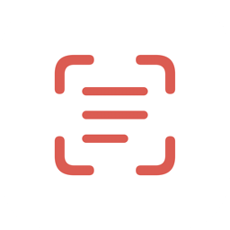

<p align="center">
  
</p>

<h1 align="center">Quirky</h1>

<p align="center">
  A lightweight macOS menu bar capture suite — five precise tools behind one global hotkey.<br>
  Press <kbd>⌘⇧1</kbd> to capture; switch tools on the fly from the floating picker.<br>
  Results land in your clipboard instantly.
</p>

---

## Modes

**OCR** — freezes the screen, highlights every recognized word. Select a region or click a word; text is in your clipboard before the overlay closes. Adjacent words on the same line merge into one clean selection.

**HEX** — eyedropper. Hover any pixel; the exact hex color follows your cursor. Click to copy.

**DOM** — element inspector for any open page in Safari/Chrome/Arc/Brave/Edge/Comet/Vivaldi/Opera. Click an element to copy its label, role, or tag.

**SVG** — extracts real SVG source from the same browsers. Click an icon or drag over several; clean vector markup lands in your clipboard, ready to paste into Figma. No browser extensions.

**SPX** — PixelSnap-style pixel measurement. Magnetic edge detection, free-drag rect → snap-on-release, ruler crosshair, resizable handles on every side, hover-reveal close button, ghost mode (⌘⇧1 toggle) lets you keep markings translucent over the live screen.

## Floating mode switcher

Enable two or more modes in the menu-bar popover. Press <kbd>⌘⇧1</kbd> — a glass pill slides in from the bottom of the screen with chips for each enabled mode. After a moment it parks itself at the nearest screen edge as a small arrow tab. Click the tab (or drag the whole pill to any edge) to bring the chips back; click another chip to switch tools without leaving capture. The pill auto-parks again after a couple of idle seconds.

## Installation

1. Download the latest `.zip` from [Releases](../../releases)
2. Unzip and drag **Quirky.app** to **Applications**
3. Launch and grant the required permissions:
   - **Screen Recording** — for capture across every mode
   - **Accessibility** — for the global hotkey
   - **Automation** — for SVG and DOM extraction from browsers (prompted on first use)

Quirky is signed with a Developer ID Application certificate and notarized by Apple — no quarantine bypass or `xattr` removal needed.

## Building from source

```bash
git clone https://github.com/halinskiy/Quirky.git
cd Quirky
xcodebuild -scheme Quirky -configuration Release build
```

The built app will be in `~/Library/Developer/Xcode/DerivedData/Quirky-*/Build/Products/Release/`.

To produce a signed + notarized release `.zip`, see `Scripts/notarize.sh` (requires Developer ID Application identity in your login keychain and a `Quirky` notarytool keychain profile — see `Scripts/notarize.sh` header for setup).

## Requirements

- macOS 13.0+ (running)
- Xcode 15+ (building from source)
- Apple Developer Program account (notarizing your own builds; not required for use)

## Tech stack

Swift, AppKit, Vision framework, CoreGraphics, ScreenCaptureKit, Sparkle for auto-updates. No SwiftUI, no Storyboards.

## License

MIT
